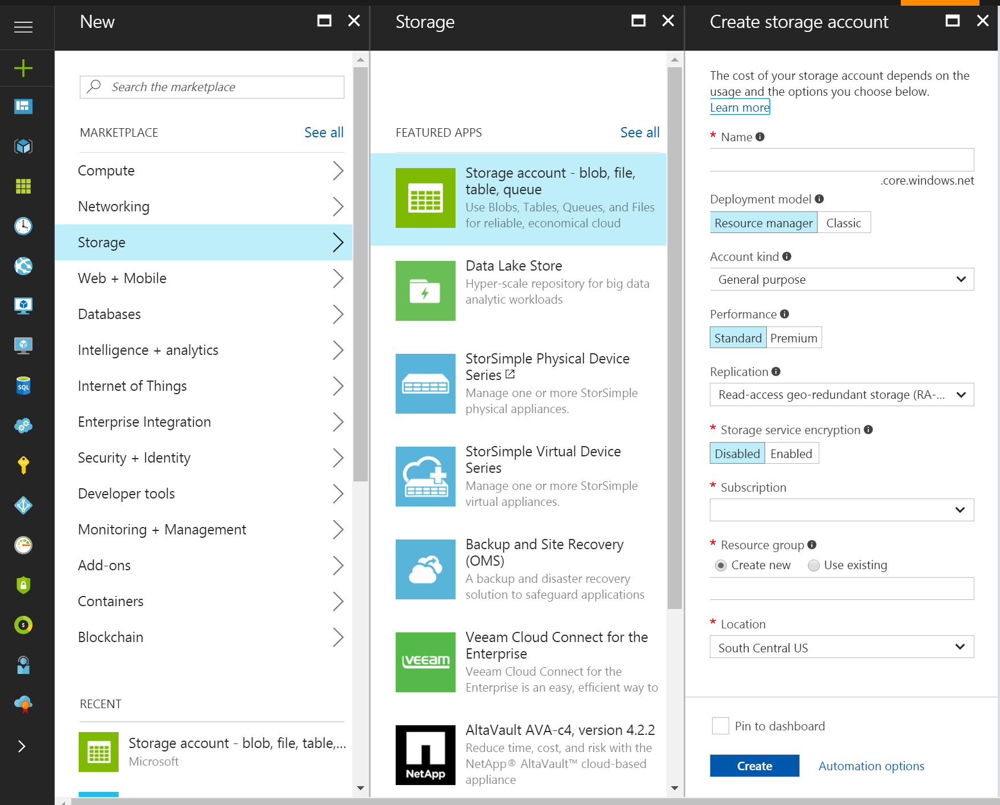
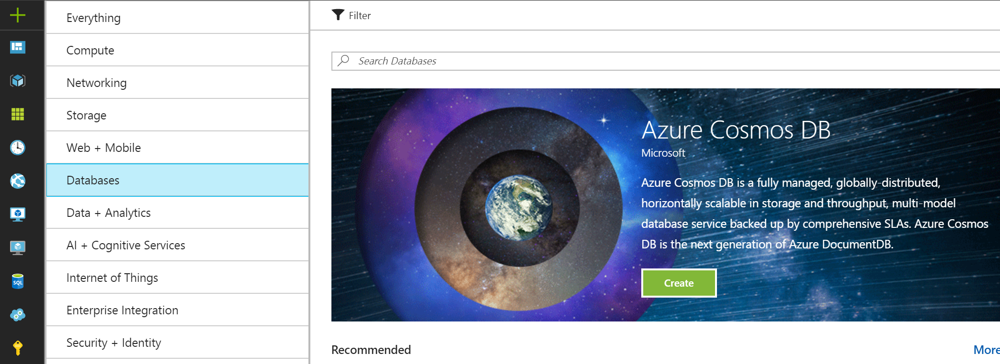
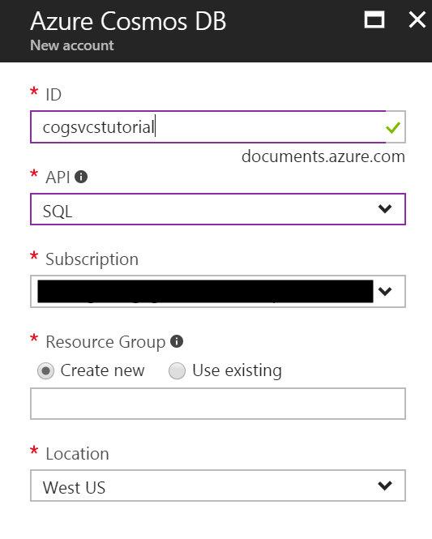

## 1_Setup:
Estimated Time: 30-40 minutes

### Lab: Setting up your Azure Account

You may activate an Azure free trial at [https://azure.microsoft.com/en-us/free/](https://azure.microsoft.com/en-us/free/).  

If you have been given an Azure Pass to complete this lab, you may go to [http://www.microsoftazurepass.com/](http://www.microsoftazurepass.com/) to activate it.  Please follow the instructions at [https://www.microsoftazurepass.com/howto](https://www.microsoftazurepass.com/howto), which document the activation process.  A Microsoft account may have **one free trial** on Azure and one Azure Pass associated with it, so if you have already activated an Azure Pass on your Microsoft account, you will need to use the free trial or use another Microsoft account.

### Lab 1.1: Setting up your Data Science Virtual Machine

After creating an Azure account, you may access the [Azure portal](https://portal.azure.com). From the portal, [create a Resource Group for this lab](https://docs.microsoft.com/en-us/azure/azure-resource-manager/resource-group-portal). Detailed information about the Data Science Virtual Machine can be [found online](https://docs.microsoft.com/en-us/azure/machine-learning/data-science-virtual-machine/overview), but we will just go over what's needed for this workshop. We are creating a VM and not doing it locally to ensure that we are all working from the same environment. This will make troubleshooting much easier. In your Resource Group, deploy and connect to a "{CSP} Data Science Virtual Machine - Windows 2016", with a size of 2-4 vCPUs and 8-12 GB RAM, some examples include but are not limited to DS4_V3, B4MS, DS3, DS3_V2, etc. **Put in the location that is closest to you: West US 2, East US, West Europe, Southeast Asia**. All other defaults are fine. 
> Note: Testing was completed on both West US 2 DS4_V3 and Southeast Asia DS4_V3.

Once you're connected, there are several things you need to do to set up the DSVM for the workshop:

1. In the Cortana search bar, type "git bash" and select "Git Bash Desktop App". Next, type `cd c://` then enter, and `git clone https://github.com/Azure/LearnAI-Bootcamp.git` then enter. This copies down all of the files from the GitHub site to **C:\LearnAI-Bootcamp**.  
*Validation step*: Go to **C:\LearnAI-Bootcamp** and confirm it exists.
2. Open "ImageProcessing.sln" which is under **C:\LearnAI-Bootcamp\lab01.1-computer_vision\resources\code\Starting-ImageProcessing**. It may take a while for Visual Studio to open for the first time, and you will have to log in. If your company has two factor authentication, you will not be able to use your pin to log in. Use your password and mobile phone authentication.  
*Validation step*: In the top right corner of Visual Studio, confirm that you see your name and account information.
3. Once you're in, if 'TestCLI' is not loaded, right-click on 'TestCLI' and select "Install Missing Features". This will prompt you to install **.Net Desktop Development**. Click **Install**, then **Install** again. You may get an error because Visual Studio needs to be closed to install updates. Close Visual Studio and then select **Retry**. It should only take 1-2 minutes to install.   
*Validation step*: Reopen "ImageProcessing.sln", confirm that you are able to expand TestCLI and see its contents.  
4. Right-click on TestCLI and select "Set as StartUp Project". Right-click on the solution in Solution Explorer and select "Build".  
*Validation step*: When you build the solution, the only errors you receive are related to `ImageProcessor.cs`. 
> Note: Be sure to turn off your DSVM after the workshop so you don't get charged.

### Lab 1.2: Collecting the Keys ###

Over the course of this lab, we will collect Cognitive Services keys and storage keys. You should save all of them in a text file so you can easily access them in future labs.

- _Cognitive Services Keys_
  - Computer Vision API:

- _Storage Keys_
  - Azure Blob Storage Connection String:
  - Cosmos DB URI:
  - Cosmos DB key:

**Getting Cognitive Services API Keys**

Within the Portal, we'll first create keys for the Cognitive Services we'll be using. We'll primarily be using the [Computer Vision](https://www.microsoft.com/cognitive-services/en-us/computer-vision-api) Cognitive Service, so let's create an API key for that first.

In the Portal, hit **Create a resource** and then enter **computer vision** in the search box and choose **Computer Vision API**:

This will lead you to fill out a few details for the API endpoint you'll be creating, choosing the API you're interested in and where you'd like your endpoint to reside (**put in the West US region or it will not work**), as well as what pricing plan you'd like. We'll be using **S1** so that we have the throughput we need for the tutorial. Use the same Resource Group that you used to create your DSVM. We'll also use this resource group for Blob Storage and Cosmos DB. _Pin to dashboard_ so that you can easily find it. Since the Computer Vision API stores images internally at Microsoft (in a secure fashion), to help improve future Cognitive Services Vision offerings, you'll need to check the box that states you're ok with this before you can create the resource.

**Double check that you put your Computer Vision service in West US**  

**Modifying `settings.json`, part one**

Once you have created your new API subscription, you can grab the keys from the appropriate section of the blade and add them to your  _TestCLI's_ `settings.json` file.

>Note: there are two keys for each of the Cognitive Services APIs you will create. Either one will work. You can read more about multiple keys [here](https://blogs.msdn.microsoft.com/mast/2013/11/06/why-does-an-azure-storage-account-have-two-access-keys/).

**Setting up Storage**

We'll be using two different stores in Azure for this project - one for storing the raw images, and the other for storing the results of our Cognitive Service calls. Azure Blob Storage is made for storing large amounts of data in a format that looks similar to a file-system, and it is a great choice for storing data like images. Azure Cosmos DB is our resilient NoSQL PaaS solution and is incredibly useful for storing loosely structured data like we have with our image metadata results. There are other possible choices (Azure Table Storage, SQL Server), but Cosmos DB gives us the flexibility to evolve our schema freely (like adding data for new services), query it easily, and integrate quickly into Azure Search.

_Azure Blob Storage_

Detailed "Getting Started" instructions can be [found online](https://docs.microsoft.com/en-us/azure/storage/storage-dotnet-how-to-use-blobs), but let's just go over what you need for this lab.

Within the Azure Portal, click **Create a resource->Storage->Storage Account**

Once you click it, you'll be presented with the fields above to fill out. 

- Choose your storage account name (lowercase letters and numbers), 
- set _Account kind_ to _Blob storage_, 
- set _Replication_ to _Locally-Redundant storage (LRS)_ (this is just to save money), 
- use the same Resource Group as above, and 
- set _Location_ to the region that is closest to you from the following list: East US, West US, Southeast Asia, West Europe.  (The list of Azure services that are available in each region is at [https://azure.microsoft.com/en-us/regions/services/](https://azure.microsoft.com/en-us/regions/services/)). _Pin to dashboard_ so that you can easily find it.

**Modifying `settings.json`, part two**

Now that you have an Azure Storage account, let's grab the _Connection String_ and add it to your _TestCLI_'s  `settings.json`.

_Cosmos DB_

Detailed "Getting Started" instructions can be [found online](https://docs.microsoft.com/en-us/azure/cosmos-db/documentdb-get-started), but we'll walk through what you need for this lab.

Within the Azure Portal, click **Create a resource->Databases->Azure Cosmos DB**.

Once you click this, you'll have to fill out a few fields as you see fit. Set _Location_ to the region that is closest to you from the following list: East US, West US, Southeast Asia, West Europe.

In our case, select the ID you'd like, subject to the constraints that it needs to be lowercase letters, numbers, or dashes. We will be using the SQL API so we can create a document database that is queryable using SQL syntax, so select `SQL` as the  API. Let's use the same Resource Group as we used for our previous steps, and the same location, select _Pin to dashboard_ to make sure we keep track of it and it's easy to get back to, and hit Create.

**Modifying `settings.json`, part three**

Once creation is complete, open the panel for your new database and select the _Keys_ sub-panel.

You'll need the **URI** and the **PRIMARY KEY** for your _TestCLI's_ `settings.json` file, so copy those into there and you're now ready to store images and data into the cloud.

### Continue to [2_ImageProcessor](./2_ImageProcessor.md)

Back to [README](./0_readme.md)
