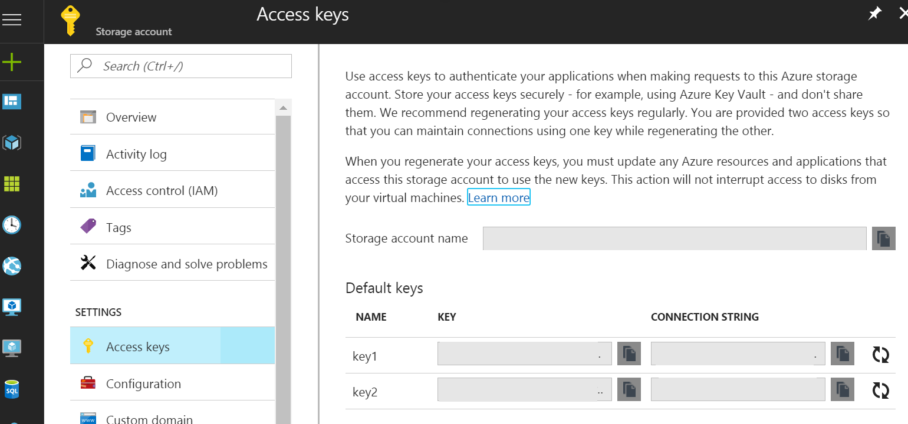
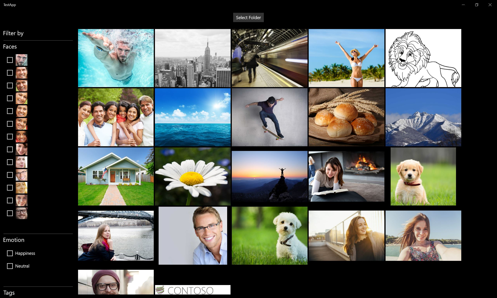
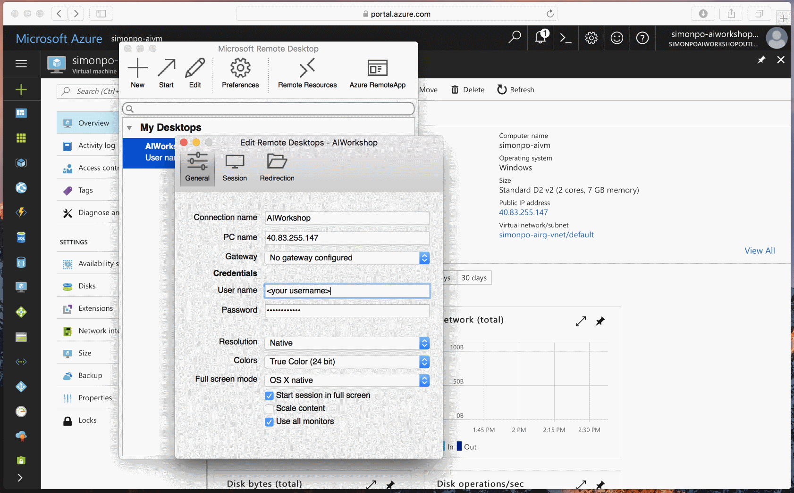
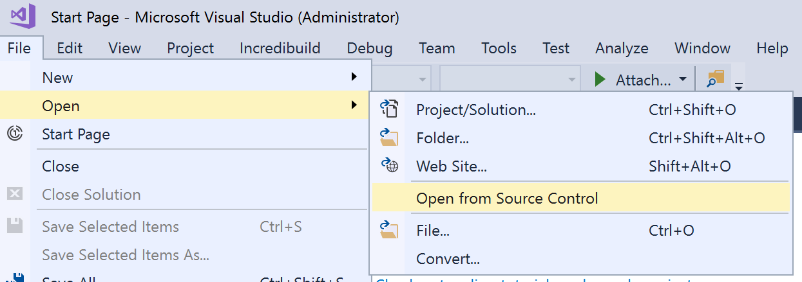
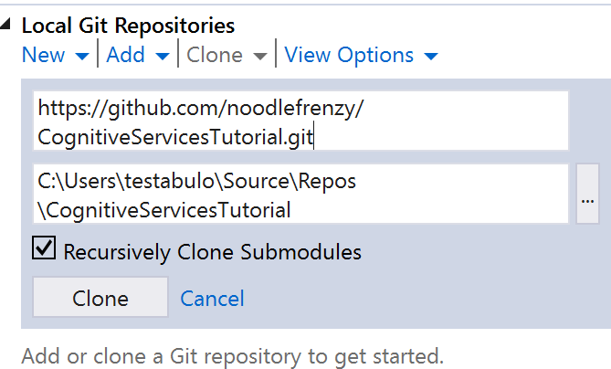

# lab01.1-pcl_and_cognitive_services - Using Portable Class Libraries to Simplify App Development with Cognitive Services

This hands-on lab guides you through creating an intelligent Windows (UWP) application from end-to-end using Cognitive Services (Computer Vision API, Emotion API, Face API). We will focus on the ImageProcessing portable class library (PCL), discussing its contents and how to use it in your own applications. 

In this workshop, you will:
- Learn about some of the various Cognitive Services APIs
- Understand how to configure your apps to call Cognitive Services
- Build an application that calls various Cognitive Services APIs (specifically Computer Vision, Face, Emotion) in .NET applications

While there is a focus on Cognitive Services, you will also leverage the following technologies:

- Visual Studio
- Windows 10 SDK (UWP)
- Cosmos DB
- Azure Storage
- Data Science Virtual Machine

 
## Prerequisites

This workshop is meant for an AI Developer on Azure. Since this is a half-day workshop, there are certain things you need before you arrive.

Firstly, you should have experience with Visual Studio. We will be using it for everything we are building in the workshop, so you should be familiar with [how to use it](https://docs.microsoft.com/en-us/visualstudio/ide/visual-studio-ide) to create applications. Additionally, this is not a class where we teach you how to code or develop applications. We assume you some familiarity with C# (you can learn [here](https://mva.microsoft.com/en-us/training-courses/c-fundamentals-for-absolute-beginners-16169?l=Lvld4EQIC_2706218949)), but you do not know how to implement solutions with Cognitive Services. 

Secondly, you should have experience with the portal and be able to create resources (and spend money) on Azure. 

## Introduction

We're going to build an end-to-end scenario that allows you to pull in your own pictures, use Cognitive Services to find objects and people in the images, figure out how those people look like they are feeling, and store all of that data in a NoSQL Store (Cosmos DB). In a continuation of this lab, `lab01.2-luis_and_search`, we will use that NoSQL Store to populate an Azure Search index, and then build a Bot Framework bot using LUIS to allow easy, targeted querying.

## Architecture

We will build a simple C# application that allows you to ingest pictures from your local drive, then invoke several different Cognitive Services to gather data on those images:

- [Computer Vision](https://www.microsoft.com/cognitive-services/en-us/computer-vision-api): We use this to grab tags and a description
- [Face](https://www.microsoft.com/cognitive-services/en-us/face-api): We use this to grab faces and their details from each image
- [Emotion](https://www.microsoft.com/cognitive-services/en-us/emotion-api): We use this to pull emotion scores from each face in the image

Once we have this data, we process it to pull out the details we need, and store it all into [Cosmos DB](https://azure.microsoft.com/en-us/services/cosmos-db/), our [NoSQL](https://en.wikipedia.org/wiki/NoSQL) [PaaS](https://azure.microsoft.com/en-us/overview/what-is-paas/) offering.

In the continuation of this lab, `lab01.2-luis_and_search`, we'll build an [Azure Search](https://azure.microsoft.com/en-us/services/search/) Index (Azure Search is our PaaS offering for faceted, fault-tolerant search - think Elastic Search without the management overhead) on top of Cosmos DB. We'll show you how to query your data, and then build a [Bot Framework](https://dev.botframework.com/) bot to query it. Finally, we'll extend this bot with [LUIS](https://www.microsoft.com/cognitive-services/en-us/language-understanding-intelligent-service-luis) to automatically derive intent from your queries and use those to direct your searches intelligently. 


> This lab was modified from this [Cognitive Services Tutorial](https://github.com/noodlefrenzy/CognitiveServicesTutorial).

## Navigating the GitHub ##

There are several directories in the [resources](./resources) folder:

- **assets**: This contains all of the images for the lab manual. You can ignore this folder.
- **code**: In here, there are several directories that we will use:
	- **Starting-ImageProcessing** and **Finished-ImageProcessing**: There is a folder for starting, which you should use if you are going through the labs, but there is also a finished folder if you get stuck or run out of time. Each folder contains a solution (.sln) that has several different projects for the workshop, let's take a high level look at them:
		- **ProcessingLibrary**: This is a Portable Class Library (PCL) containing helper classes for accessing the various Cognitive Services related to Vision, and some "Insights" classes for encapsulating the results.
		- **ImageStorageLibrary**: Since Cosmos DB does not (yet) support UWP, this is a non-portable library for accessing Blob Storage and Cosmos DB.
		- **TestApp**: A UWP application that allows you to load your images and call the various cognitive services on them, then explore the results. Useful for experimentation and exploration of your images.
		- **TestCLI**: A Console application allowing you to call the various cognitive services and then upload the images and data to Azure. Images are uploaded to Blob Storage, and the various metadata (tags, captions, faces) are uploaded to Cosmos DB.

		Both _TestApp_ and _TestCLI_ contain a `settings.json` file containing the various keys and endpoints needed for accessing the Cognitive Services and Azure. They start blank, so once you provision your resources, we will grab your service keys and set up your storage account and Cosmos DB instance.
		
### Lab: Setting up your Azure Account

You may activate an Azure free trial at [https://azure.microsoft.com/en-us/free/](https://azure.microsoft.com/en-us/free/).  

If you have been given an Azure Pass to complete this lab, you may go to [http://www.microsoftazurepass.com/](http://www.microsoftazurepass.com/) to activate it.  Please follow the instructions at [https://www.microsoftazurepass.com/howto](https://www.microsoftazurepass.com/howto), which document the activation process.  A Microsoft account may have **one free trial** on Azure and one Azure Pass associated with it, so if you have already activated an Azure Pass on your Microsoft account, you will need to use the free trial or use another Microsoft account.

### Lab: Setting up your Data Science Virtual Machine

After creating an Azure account, you may access the [Azure portal](https://portal.azure.com). From the portal, create a Resource Group for this lab. Detailed information about the Data Science Virtual Machine can be [found online](https://docs.microsoft.com/en-us/azure/machine-learning/data-science-virtual-machine/overview), but we will just go over what's needed for this workshop. In your Resource Group, deploy and connect to a Data Science Virtual Machine for Windows (2016), with a size of D4S_V3 (this is only available on certain regions, try "West US" or "East US 2"). All other defaults are fine.
>We are creating a VM and not doing it locally, because many of you will not have the ability to change your machine to "Developer Mode" which we need to develop UWP apps.

Once you're connected, there are several things you need to do to set up the DSVM for the workshop:

1. Navigate to this repository in Firefox, and download it as a zip file. Extract all the files, and move the folder for this lab to your Desktop.
2. Open "ImageProcessing.sln" which is under resources>code>Starting-ImageProcessing. It may take a while for Visual Studio to open for the first time, and you will have to log in.
3. Once it's open, you will be prompted to install the SDK for Windows 10 App Development (UWP). Follow the prompts to install it (you'll have to close Visual Studio). If you aren't prompted, right click on TestApp and select "Reload project", then you will be prompted.
4. While it's installing, there are a few tasks you can complete: 
	- Type in the Cortana search bar "For developers settings" and change the settings to "Developer Mode".
	- Type in the Cortana search bar "gpedit.msc" and push enter. Enable the following policy: Computer Configuration>Windows Settings>Security Settings>Local Policies>Security Options>User Account Control: Admin Approval Mode for the Built-in Administrator account
	- Start the "Collecting the keys" lab. 
5. Once the install is complete and you have changed your devleoper settings and the User Account Control policy, reboot your DSVM. 
> Note: Be sure to turn off your DSVM after the workshop so you don't get charged.


### Lab: Collecting the Keys

Over the course of this lab, we will collect Cognitive Services keys and storage keys. You should save all of them in a text file so you can easily access them in future labs.

- _Cognitive Services Keys_
  - Computer Vision API:
  - Face API:
  - Emotion API:

- _Storage Keys_
  - Azure Blob Storage Connection String:
  - Cosmos DB URI:
  - Cosmos DB key:

**Getting Cognitive Services API Keys**

Within the Portal, we'll first create keys for the Cognitive Services we'll be using. We'll primarily be using different APIs under the [Computer Vision](https://www.microsoft.com/cognitive-services/en-us/computer-vision-api) Cognitive Service, so let's create an API key for that first.

In the Portal, hit **New** and then enter **cognitive** in the search box and choose **Computer Vision API**:


This will lead you to fill out a few details for the API endpoint you'll be creating, choosing the API you're interested in and where you'd like your endpoint to reside, as well as what pricing plan you'd like. We'll be using S1 so that we have the throughput we need for the tutorial and creating a new _Resource Group_. We'll be using this same resource group below for our Blob Storage and Cosmos DB. _Pin to dashboard_ so that you can easily find it. Since the Computer Vision API stores images internally at Microsoft (in a secure fashion), to help improve future Cognitive Services Vision offerings, you'll need to check the box that states you're ok with this before you can create the resource.


Once you have created your new API subscription, you can grab the keys from the appropriate section of the blade and add them to your _TestApp's_ and _TestCLI's_ `settings.json` file.


We'll also be using other APIs within the Cognitive Services family, so take this opportunity to create API keys for the **Emotion** and **Face** APIs as well. They are created in the same fashion as above, except you'll need to use the **S0** pricing for the Emotion API and Face API. Make sure to select _Pin to Dashboard_, and then add those keys to your `settings.json` files.


**Setting up Storage**

We'll be using two different stores in Azure for this project - one for storing the raw images, and the other for storing the results of our Cognitive Service calls. Azure Blob Storage is made for storing large amounts of data in a format that looks similar to a file-system, and it is a great choice for storing data like images. Azure Cosmos DB is our resilient NoSQL PaaS solution and is incredibly useful for storing loosely structured data like we have with our image metadata results. There are other possible choices (Azure Table Storage, SQL Server), but Cosmos DB gives us the flexibility to evolve our schema freely (like adding data for new services), query it easily, and integrate quickly into Azure Search.

_Azure Blob Storage_

Detailed "Getting Started" instructions can be [found online](https://docs.microsoft.com/en-us/azure/storage/storage-dotnet-how-to-use-blobs), but let's just go over what you need for this lab.

Within the Azure Portal, click **New->Storage->Storage Account**


Once you click it, you'll be presented with the fields above to fill out. 

- Choose your storage account name (lowercase letters and numbers), 
- set _Account kind_ to _Blob storage_, 
- set _Replication_ to _Locally-Redundant storage (LRS)_ (this is just to save money), 
- use the same Resource Group as above, and 
- set _Location_ to _West US_.  (The list of Azure services that are available in each region is at [https://azure.microsoft.com/en-us/regions/services/](https://azure.microsoft.com/en-us/regions/services/)). _Pin to dashboard_ so that you can easily find it.

Now that you have an Azure Storage account, let's grab the _Connection String_ and add it to your _TestCLI_ and _TestApp_ `settings.json`.



_Cosmos DB_

Detailed "Getting Started" instructions can be [found online](https://docs.microsoft.com/en-us/azure/cosmos-db/documentdb-get-started), but we'll walk through what you need for this lab.

Within the Azure Portal, click **New->Databases->Azure Cosmos DB**.


Once you click this, you'll have to fill out a few fields as you see fit. 


In our case, select the ID you'd like, subject to the constraints that it needs to be lowercase letters, numbers, or dashes. We will be using the Document DB SDK and not Mongo, so select `SQL` as the  API. Let's use the same Resource Group as we used for our previous steps, and the same location, select _Pin to dashboard_ to make sure we keep track of it and it's easy to get back to, and hit Create.

Once creation is complete, open the panel for your new database and select the _Keys_ sub-panel.


You'll need the **URI** and the **PRIMARY KEY** for your _TestCLI's_ and the _TestApp's_ `settings.json` file, so copy those into there and you're now ready to store images and data into the cloud.


## Cognitive Services

Cognitive Services can be used to infuse your apps, websites and bots with algorithms to see, hear, speak, understand and interpret your user needs through natural methods of communication. 

There are five main categories for the available Cognitive Services:
- **Vision**: Image-processing algorithms to identify, caption and moderate your pictures
- **Knowledge**: Map complex information and data in order to solve tasks such as intelligent recommendations and semantic search
- **Language**: Allow your apps to process natural language with pre-built scripts, evaluate sentiment and learn how to recognize what users want
- **Speech**: Convert spoken audio into text, use voice for verification, or add speaker recognition to your app
- **Search**: Add Bing Search APIs to your apps and harness the ability to comb billions of webpages, images, videos, and news with a single API call

You can browse all of the specific APIs in the [Services Directory](https://azure.microsoft.com/en-us/services/cognitive-services/directory/). 

As you may recall, the application we'll be building today will use [Computer Vision](https://www.microsoft.com/cognitive-services/en-us/computer-vision-api) to grab tags and a description, [Face](https://www.microsoft.com/cognitive-services/en-us/face-api) to grab faces and their details from each image, and [Emotion](https://www.microsoft.com/cognitive-services/en-us/emotion-api) to pull emotion scores from each face in the image.

Let's talk about how we're going to call these Cognitive Services in our application.

### **Image Processing Library** ###

Under resources>code>Starting-ImageProcessing, you'll find the `Processing Library`. This is a [Portable Class Library (PCL)](https://docs.microsoft.com/en-us/dotnet/standard/cross-platform/cross-platform-development-with-the-portable-class-library), which helps in building cross-platform apps and libraries quickly and easily. It serves as a wrapper around several services. This specific PCL contains various helper classes for accessing the various Cognitive Services related to Vision, and several "Insights" classes to encapsulate the results. Later, we'll create an image processor class that will be responsible for wrapping an image and exposing several methods and properties that act as a bridge to the Cognitive Services. 

After creating the image processor, you should be able to pick up this portable class library and drop it in your other projects that involve Cognitive Services (some modification may be required). 


**Service Helpers**

Service helpers exist to make your life easier when you're developing your app. One of the key things that service helpers do is provide the ability to detect when the API calls return a call-rate-exceeded error and automatically retry the call (after some delay). They also help with bringing in methods, handling exceptions and handling the keys.

You can find additional service helpers for some of the other Cognitive Services within the [Intelligent Kiosk sample application](https://github.com/Microsoft/Cognitive-Samples-IntelligentKiosk/tree/master/Kiosk/ServiceHelpers). Utilizing these resources makes it easy to add and remove the service helpers in your future projects as needed.


**The "Insights" classes**

Take a look at each of the "Insights" classes:
- If you look at `FaceInsights.cs`, you can see the items we ultimately want from the Face and Emotion APIs: `UniqueFaceID`, `FaceRectangle`, `TopEmotion`, `Gender`, and `Age`
- You can see that in `VisionInsights.cs`, we're calling for `Caption` and `Tags` from the images. 
- Finally, in `ImageInsights.cs`, we're creating our complete Image Insights for each image, with the `ImageId`, `FaceInsights` and `VisionInsights`.

Overall, the "Insights" group only the pieces of information we want from the Cognitive Services.

Now let's take a step back for a minute. It isn't quite as simple as creating "Insights" classes and copying over some methods/error handling from service helpers. We still have to call the API and process the images somewhere. For the purpose of this lab, we are going to walk through creating `ImageProcessor.cs`, but in future projects, feel free to add this class to your PCL and start from there (it may need modification depending what Cognitive Services you are calling and what you are processing - images, text, voice, etc.).


### Lab: Creating `ImageProcessor.cs`

Navigate to `ImageProcessor.cs` within `ImageProcessingLibrary`. 

Add the following code to the top:

```
using Microsoft.ProjectOxford.Common.Contract;
using Microsoft.ProjectOxford.Face;
using Microsoft.ProjectOxford.Face.Contract;
using Microsoft.ProjectOxford.Vision;
using ServiceHelpers;
```

[Project Oxford](https://blogs.technet.microsoft.com/machinelearning/tag/project-oxford/) was the project where many Cognitive Services got their start. As you can see, the NuGet Packages were even labeled under Project Oxford. In this scenario, we'll call `Microsoft.ProjectOxford.Common.Contract` for the Emotion API, `Microsoft.ProjectOxford.Face` and `Microsoft.ProjectOxford.Face.Contract` for the Face API, and `Microsoft.Oxford.Vision` for the Computer Vision API. Additionally, we'll reference our service helpers (remember, these will make our lives easier). You'll have to reference different packages depending on which Cogitive Services you're leveraging in your application.

Right at the beginning of our image processor, we're going to set up some static arrays that we'll fill in throughout the processor. As you can see, these are the main attributes we want to call for `ImageInsights.cs`. Add the code below:

```
private static FaceAttributeType[] DefaultFaceAttributeTypes = new FaceAttributeType[] { FaceAttributeType.Age, FaceAttributeType.Gender };

private static VisualFeature[] DefaultVisualFeatureTypes = new VisualFeature[] { VisualFeature.Tags, VisualFeature.Description };
```

Next, create a public task that we'll use to trigger computer vision, face and emotion analysis:

```
    public static async Task<ImageInsights> ProcessImageAsync(Func<Task<Stream>> imageStreamCallback, string imageId)
    {
        ImageInsights result = new ImageInsights { ImageId = imageId };

        // trigger computer vision, face and emotion analysis
        List<Emotion> emotionResult = new List<Emotion>();
        await Task.WhenAll(AnalyzeImageFeaturesAsync(imageStreamCallback, result), AnalyzeFacesAsync(imageStreamCallback, result), AnalyzeEmotionAsync(imageStreamCallback, emotionResult));
         
        // eventually we will combine emotion and face results based on face rectangle location/size similarity below

        return result;
    }
```

In the code above, you see that the result of our task is populating ImageInsights. You can also see there is an `await` for three methods: `AnalyzeImageFeaturesAsync`, `AnalyzeFacesAsync` and `AnalyzeEmotionAsync`. Since this public method invokes three other methods, it’s good practice to make those private since they’re not part of the API (at least for this project). Create a `private static async Task` for each. 

> Hint 1: The code for the first one is shown below. The other two are very similar, except `AnalyzeEmotionAsync` will have a different output (which you may be able to glean from the public task you created earlier). Turn to a neighbor if you need help. 


```
    private static async Task AnalyzeImageFeaturesAsync(Func<Task<Stream>> imageStreamCallback, ImageInsights result)
    {

    }
```

> Hint 2: We use `Func<Task<Stream>>` because we want to make sure we can process the image multiple times (once for each service that needs it), so we have a Func that can hand us back a way to get the stream. Since getting a stream is usually an async operation, rather than the Func handing back the stream itself, it hands back a task that allows us to do so in an async fashion.


Let's work on the `AnalyzeImageFeaturesAsync` method first. We'll create a variable called `imageAnalysisResult` that uses `VisionServiceHelper.AnalyzeImageAsync` (service helper making life easier) to analyze the image's features (returns `DefaultVisualFeatureTypes`). Next, we'll output VisionInsights for the image, containing the Caption and Tags. See code below:

```
    var imageAnalysisResult = await VisionServiceHelper.AnalyzeImageAsync(imageStreamCallback, DefaultVisualFeatureTypes);

        result.VisionInsights = new VisionInsights
            {
                Caption = imageAnalysisResult.Description.Captions[0].Text,
                Tags = imageAnalysisResult.Tags.Select(t => t.Name).ToArray()
            };
```

So now we have the caption and tags that we need from the Computer Vision API, and they're stored in `result.VisionInsights`. 

Next let's add to `AnalyzeFacesAsync` so we can use the Face API to locate the face rectangles (that our app will use to let you filter faces) and the age/gender of the people detected. In the following code, we use the FaceServiceHelper to detect if there are faces in the image. If there are, we want the FaceId and the FaceAttributes (specifically age and gender). Add below code:

```
    var faces = await FaceServiceHelper.DetectAsync(imageStreamCallback, returnFaceId: true, returnFaceLandmarks: false, returnFaceAttributes: DefaultFaceAttributeTypes);
```

If there's more than one face, we'll need to make a list of the insights, and then cycle through each. You'll need to determine how we add the `detectedFace` attributes to FaceInsights, as well as how we determine the face ID. Here's a skeleton of the code you'll need to complete:

```
    List<FaceInsights> faceInsightsList = new List<FaceInsights>();
    foreach (Face detectedFace in faces)
    {
        FaceInsights faceInsights = new FaceInsights
        {
            FaceRectangle = ,
            Age = ,
            Gender = ,
        };

        SimilarPersistedFace similarPersistedFace = await FaceListManager.FindSimilarPersistedFaceAsync(imageStreamCallback, detectedFace.FaceId, detectedFace);
        if (similarPersistedFace != null)
        {
            faceInsights.UniqueFaceId = ;
        }
            faceInsightsList.Add(faceInsights);
        }

        result.FaceInsights = faceInsightsList.ToArray();
```

> Hints: Remember, in the first part, we're just spelling out what we've already returned (start with `detectedFace.` and use the dropdowns to help). In the second part, determine what the it means if the if statement is true. Turn to a neighbor if you need help.

Note that at the end of the foreach loop, we're adding our insights to the list, and at the very end, we're adding the list of insights to our output result (`result.FaceInsights`).

Next, let's modify `AnalyzeEmotionAsync`. We only need one line of code (service helpers make our lives easier!) to grab all of the face emotions. This code also gives an additional hint for what the output for `AnalyzeEmotionAsync` should be. Add below code:

```
    faceEmotions.AddRange(await EmotionServiceHelper.RecognizeAsync(imageStreamCallback));
```

Note that this doesn't return the TopEmotion that we originally wanted for our FaceInsights (take a look at `FaceInsights.cs`). We don't want to include the scores for each emotion or list all the emotions for everyone. We really just care about the main emotion each face shows. Similar to `AnalyzeFacesAsync`, we will use a foreach loop to find the top emotion and store it in faceInsights. Below what you already have in `ProcessImageAsync` (but above `return result;`), paste in the following skeleton code:

```
    foreach (var faceInsights in result.FaceInsights)
    {
        Emotion faceEmotion = CoreUtil.FindFaceClosestToRegion(emotionResult, faceInsights.FaceRectangle);
        if (faceEmotion != null)
        {
            faceInsights.TopEmotion = ;
        }
    }
```


> Hint: Figure out what we're doing with the if statement. What do we want to grab `if faceEmotion != null`? 

> Still stuck? Start with `faceEmotion.` and use the dropdowns to help. 

Now that you've built `ImageProcessor.cs`, don't forget to save it! Below, you'll find a flowchart that summarizes how `ImageProcessor.cs` works. There are three levels, the top represents the first set of async tasks, the second represents the second (adding the TopEmotion to FaceInsights with the help of `AnalyzeFacesAsync` and `AnalyzeEmotionAsync`), and the bottom represents the ultimate result from the processor.


Want to make sure you set up `ImageProcessor.cs` correctly? You can find the full class [here](./resources/code/classes).


### Lab: Building and exploring the TestApp

We've spent some time looking at the `ImageProcessingLibrary`, but you will also find a UWP application (`TestApp`) that allows you to load your images and call the various Cognitive Services on them, then explore the results. It is useful for experimentation and exploration of your images. This app is built on top of the `ImageProcessingLibrary` project, which is also used  by the TestCLI project to analyze the images. 

You'll want to "Build" the solution (right click on `ImageProcessing.sln` and select "Build Solution"). You also may have to reload the TestApp project, which you can do by right-clicking on it and selecting "Reload project". 

Before running the app, make sure to enter the Cognitive Services API keys in the `settings.json` file under the `TestApp` project. Once you do that, run the app, point it to any folder (you will need to unzip `sample_images` first) with images (via the `Select Folder` button), and it should generate results like the following, showing all the images it processed, along with a breakdown of unique faces, emotions and tags that also act as filters on the image collection.



Once the app processes a given directory it will cache the results in a `ImageInsights.json` file in that same folder, allowing you to look at that folder results again without having to call the various APIs. Open the file and examine the results. Are they structured how you expected? Discuss with a neighbor. 

## (optional) Exploring Cosmos DB

Azure Cosmos DB is our resilient NoSQL PaaS solution and is incredibly useful for storing loosely structured data like we have with our image metadata results. There are other possible choices (Azure Table Storage, SQL Server), but Cosmos DB gives us the flexibility to evolve our schema freely (like adding data for new services), query it easily, and can be quickly integrated into Azure Search (which we'll do in `lab01.2-luis_and_search`).

Cosmos DB is not a focus of this workshop, but if you're interested in what's going on - here are some highlights from the code we will be using:
- Navigate to the `DocumentDBHelper.cs` class in the `ImageStorageLibrary`. Many of the implementations we are using can be found in the [Getting Started guide](https://docs.microsoft.com/en-us/azure/cosmos-db/documentdb-get-started).
- Go to `TestCLI`'s `Util.cs` and review  the `ImageMetadata` class. This is where we turn the `ImageInsights` we retrieve from Cognitive Services into appropriate Metadata to be stored into Cosmos DB.
- Finally, look in `Program.cs` and notice in `ProcessDirectoryAsync`. First, we check if the image and metadata have already been uploaded - we can use `DocumentDBHelper` to find the document by ID and to return `null` if the document doesn't exist. Next, if we've set `forceUpdate` or the image hasn't been processed before, we'll call the Cognitive Services using `ImageProcessor` from the `ImageProcessingLibrary` and retrieve the `ImageInsights`, which we add to our current `ImageMetadata`. 
- Once all of that is complete, we can store our image - first the actual image into Blob Storage using our `BlobStorageHelper` instance, and then the `ImageMetadata` into Cosmos DB using our `DocumentDBHelper` instance. If the document already existed (based on our previous check), we should update the existing document. Otherwise, we should be creating a new one.

### (optional) Lab: Loading Images using TestCLI

We will implement the main processing and storage code as a command-line/console application because this allows you to concentrate on the processing code without having to worry about event loops, forms, or any other UX related distractions. Feel free to add your own UX later.

Once you've set your Cognitive Services API keys, your Azure Blob Storage Connection String, and your Cosmos DB Endpoint URI and Key in your _TestCLI's_ `settings.json`, you can run the _TestCLI_.

Run _TestCLI_, then open Command Prompt and navigate to your Starting-ImageProcessing\TestCLI folder (Hint: use the "cd" command to change directories). Then enter `.\bin\Debug\TestCLI.exe`. You should get the following result:

```
    > .\bin\Debug\TestCLI.exe

    Usage:  [options]

    Options:
    -force            Use to force update even if file has already been added.
    -settings         The settings file (optional, will use embedded resource settings.json if not set)
    -process          The directory to process
    -query            The query to run
    -? | -h | --help  Show help information
```

By default, it will load your settings from `settings.json` (it builds it into the `.exe`), but you can provide your own using the `-settings` flag. To load images (and their metadata from Cognitive Services) into your cloud storage, you can just tell _TestCLI_ to `-process` your image directory as follows:

```
    > .\bin\Debug\TestCLI.exe -process c:\my\image\directory
```

Once it's done processing, you can query against your Cosmos DB directly using _TestCLI_ as follows:

```
    > .\bin\Debug\TestCLI.exe -query "select * from images"
```

#### Finish early? Try this ####

What if we needed to port our application to another language? Modify your code to call the [Translator API](https://azure.microsoft.com/en-us/services/cognitive-services/translator-text-api/) on the caption and tags you get back from the Vision service.

Look into the _Image Processing Library_ at the _Service Helpers_. You can copy one of these and use it to invoke the [Translator API](https://docs.microsofttranslator.com/text-translate.html). Now you can hook this into the `ImageProcessor.cs`. Try adding translated versions to your `ImageInsights` class, and then wire it through to the DocuementDB `ImageMetadata` class. 


## Lab Completion

In this lab we covered creating an intelligent bot from end-to-end using the Microsoft Bot Framework, Azure Search and several Cognitive Services.

You should have learned:
- What the various Cognitive Services APIs are
- How to configure your apps to call Cognitive Services
- How to build an application that calls various Cognitive Services APIs (specifically Computer Vision, Face, Emotion and LUIS) in .NET applications


## Appendix ##

### Further resources ###

- [Cognitive Services](https://www.microsoft.com/cognitive-services)
- [Cosmos DB](https://docs.microsoft.com/en-us/azure/cosmos-db/)
- [Azure Search](https://azure.microsoft.com/en-us/services/search/)
- [Bot Developer Portal](http://dev.botframework.com)


### Connecting to your VM ###

#### From a Windows PC ####

Once your VM is created, hit "Connect" and it will download an RDP configuration file that should allow you to connect to the machine. On Windows, MSTSC is already installed and will automatically open when you double-click that file, log in using the credentials you specified on creation, and you'll be presented with a new Windows VM. Load up Visual Studio using the Start menu and once you sign in and it gets through the initial "first time use" screen you should be ready to go.

#### From a Mac ####

If you're using a Mac you may need to install [Microsoft Remote Desktop from the App Store](https://itunes.apple.com/us/app/microsoft-remote-desktop/id715768417?mt=12), which will allow you to connect to the Windows VM you've created and use it as if you were sitting in front of it. Once you've got Remote Desktop running, click New to create a new connection, give your connection a name, and enter the Public IP address of your VM in the "PC name" field. You can enter your User name and Password too, if you want to have them automatically sent every time you log in. 

 

Close the "Edit remote desktops" window, then double-click your new connection to launch a remote desktop session to your VM. Load up Visual Studio using the Start menu and once you sign in and it gets through the initial "first time use" screen you should be ready to go.

### Loading the Project from Visual Studio ###

If you've never used Git from within Visual Studio, it is easy to clone and open solutions directly from within the tool. From the File menu, just choose Open->Open from Source Control:



and that will load a window allowing you to clone a GitHub repo (well, any remote repo) locally:



Once you've cloned, you should be able to navigate the directory using the Solution Explorer and open the .sln file you want.