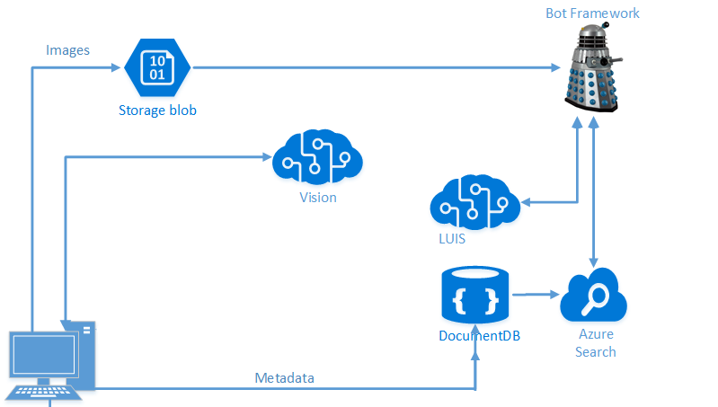

# Developing LUIS Applications with LUIS 

This hands-on lab guides you through creating a model to enhance the Natural Language Processing capabilities of your applications, using Microsoft's Language Understanding Intelligent Service (LUIS). 

## Objectives
In this lab, you will:
- Build, train and publish a LUIS model to help your bot (which will be created in a future lab) communicate effectively

While there is a focus on LUIS, you will also leverage the following technologies:

- Data Science Virtual Machine (DSVM)

## Prerequisites

This workshop is meant for an AI Developer on Azure. Since this is a short workshop, there are certain things you need before you arrive.

You should have some experience developing bots with Microsoft's Bot Framework. We won't spend a lot of time discussing how to design them or how dialogs work. If you are not familiar with the Bot Framework, you should take [this Microsoft Virtual Academy course](https://mva.microsoft.com/en-us/training-courses/creating-bots-in-the-microsoft-bot-framework-using-c-17590#!) prior to attending the workshop.

Also, you should have experience with the portal and be able to create resources (and spend money) on Azure. We will not be providing Azure passes for this workshop.

>Note: This workshop was developed and tested on a Data Science Virtual Machine (DSVM) with Visual Studio Community Version 15.4.0

## Introduction

We're going to build an end-to-end scenario that allows you to pull in your own pictures, use Cognitive Services to find objects and people in the images, obtain a description and tags, and store all of that data into a NoSQL Store (CosmosDB). We'll use that NoSQL Store to populate an Azure Search index, and then build a Bot Framework bot using LUIS to allow easy, targeted querying.

> Note: In this lab, we will only be creating the LUIS model that you will use in a future lab to build a more intelligent bot.

## Architecture

In `lab01.1-computer_vision`, we built a simple C# application that allows you to ingest pictures from your local drive, then invoke the [Computer Vision](https://www.microsoft.com/cognitive-services/en-us/computer-vision-api) Cognitive Service to grab tags and a description for those images:

Once we had this data, we processed it and stored all the information needed in [DocumentDB](https://azure.microsoft.com/en-us/services/documentdb/), our [NoSQL](https://en.wikipedia.org/wiki/NoSQL) [PaaS](https://azure.microsoft.com/en-us/overview/what-is-paas/) offering.

Now that we have it in DocumentDB, we'll build an [Azure Search](https://azure.microsoft.com/en-us/services/search/) Index on top of it (Azure Search is our PaaS offering for faceted, fault-tolerant search - think Elastic Search without the management overhead). We'll show you how to query your data, and then build a [Bot Framework](https://dev.botframework.com/) bot to query it. Finally, we'll extend this bot with [LUIS](https://www.microsoft.com/cognitive-services/en-us/language-understanding-intelligent-service-luis) to automatically derive intent from your queries and use those to direct your searches intelligently. 

> Note: In this lab, we will only be creating the LUIS model that you will use in a future lab to build a more intelligent bot.

> This lab was modified from this [Cognitive Services Tutorial](https://github.com/noodlefrenzy/CognitiveServicesTutorial).

## Navigating the GitHub ##

There are several directories in the [resources](./resources) folder:

- **assets**: This contains all of the images for the lab manual. You can ignore this folder.
- **code**: In here, there are several directories that we will use:
	- **LUIS**: Here you will find the LUIS model for the PictureBot. You will create your own, but if you fall behind or want to test out a different LUIS model, you can use the .json file to import this LUIS app.

## Collecting the Keys

Over the course of the remainder of the workshop, we will collect various keys. It is recommended that you save all of them in a text file, so you can easily access them throughout the workshop.

>_Keys_
>- LUIS API:
>- Cosmos DB Connection String:
>- Azure Search Name:
>- Azure Search Key:
>- Bot Framework App Name:
>- Bot Framework App ID:
>- Bot Framework App Password:

### Continue to [the lab](./1_LUIS.md)

