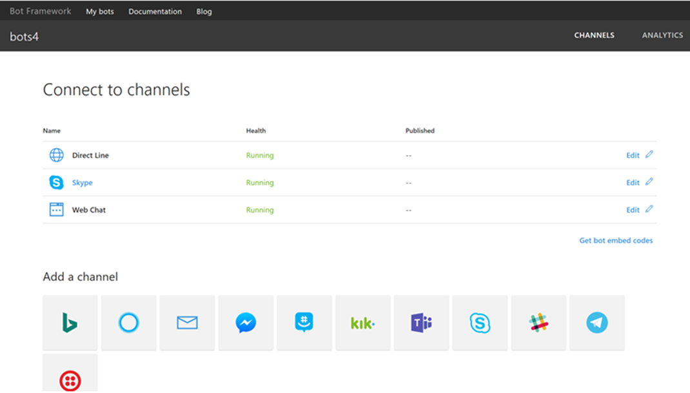
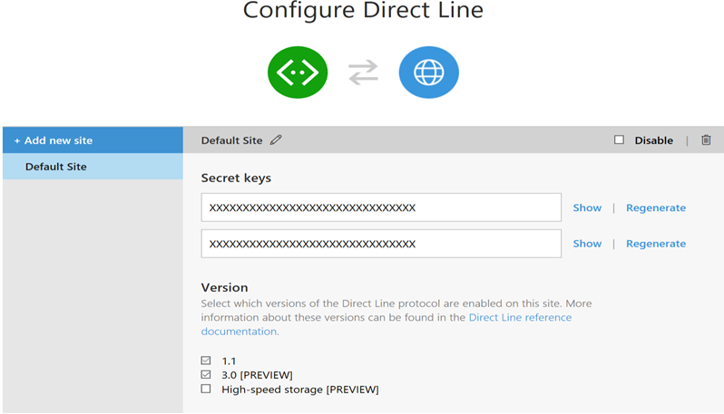
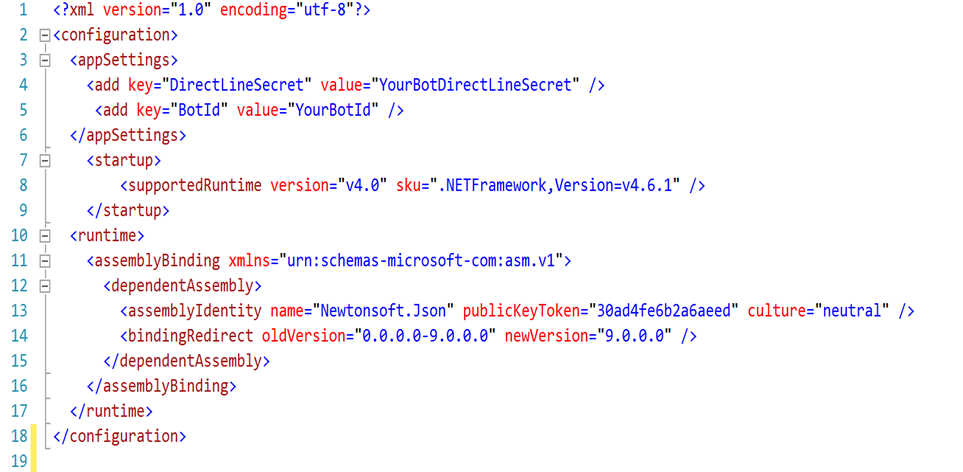
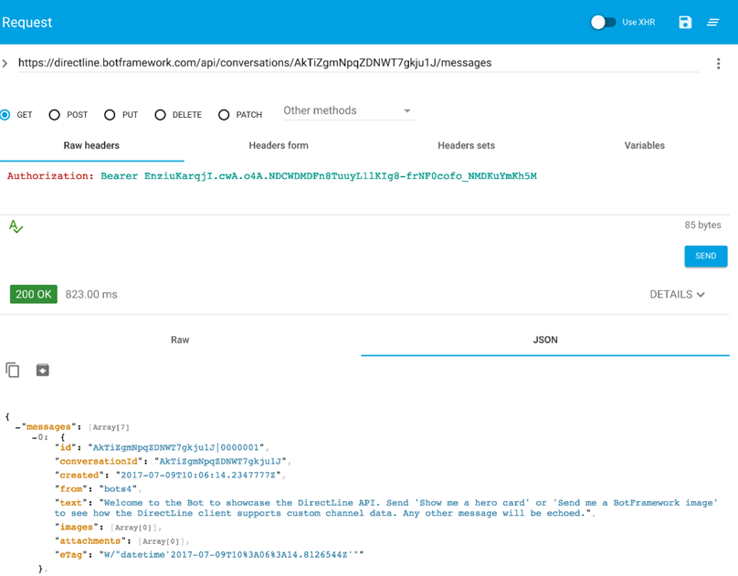

# Connect directly to a Bot  - Direct Line

## Objectives

Communication directly with your bot may be required in some situations. For example, you may want to perform functional tests with a hosted bot. Communication between your bot and your own client application can be performed using [Direct Line API](https://docs.microsoft.com/en-us/bot-framework/rest-api/bot-framework-rest-direct-line-3-0-concepts). This hands-on lab introduces key concepts related to Direct Line API.

## Setup

1. Open the project from code\core-DirectLine and import the solution in Visual Studio.

2. In the DirectLineBot solution, you will find two projects: DirectLineBot and DirectLineSampleClient. You can choose to use the **published bot (from the earlier labs) or publish DirectLineBot** for this lab.

To use DirectLineBot, you must:

- Deploy it to Azure. Follow [this tutorial](https://docs.microsoft.com/en-us/bot-framework/deploy-dotnet-bot-visual-studio) to learn how to deploy a .NET bot to Azure directly from Visual Studio.

- Register it with the Bot Framework before others can use DirectLineBot. The steps to register can be found in the [registration instructions](https://docs.microsoft.com/en-us/bot-framework/portal-register-bot).


DirectLineSampleClient is the client that will send messages to the bot.

## Authentication

Direct Line API requests can be authenticated either by using a secret that you obtain from the Direct Line channel configuration page in the Bot Framework Portal. Go to the Bot Framework Portal and find your bot. Add Direct Line via *Connect to channels* for your bot.



You can obtain a Secret Key from the Direct Line channel after adding as shown below:



**Security Scope**

Secret Key: Secret key is application wide and is embedded in the client application. Every conversation that is initiated by the application would use the same secret. This makes it very convenient.

Tokens: A token is conversation specific. You request a token using that secret and you can initiate a conversation with that token. Its valid for 30 minutes from when it is issued but it can be refreshed.

## App Config

The Secret key obtained from *Configure Direct Line* in the Bot Framework Portal is then added to the Configuration settings in App.config file as shown below. In addition, for the published bot, capture the bot id and enter in the appSettings part of App.config from DirectLineSampleClient project. The relevant lines of App.config to enter in the App.config are listed as follows:

```
<add key="DirectLineSecret" value="YourBotDirectLineSecret" />
<add key="BotId" value="YourBotId" />
```



## Sending and Receiving Messages

Using Direct Line API, a client can send messages to your bot by issuing HTTP Post requests. A client can receive messages from your bot either via WebSocket stream or by issuing HTTP GET requests. In this lab, we will explore HTTP Get option to receive messages.

1.	Run project DirectLineSampleClient after making the Config changes.

2.	Submit a message via console and obtain the conversation id. Line 52 of Program.cs prints the conversation ID that you will need in order to talk to bots:

````Console.WriteLine("Conversation ID:" + conversation.ConversationId);````


3.	Once you have the conversation id, you can retrieve user and bot messages using HTTP Get. To retrieve messages for a specific conversation, you can issue a GET request to https://directline.botframework.com/api/conversations/{conversationId}/messages endpoint. You will also need to pass the Secret Key as part of raw header (i.e. Authorization: Bearer {secretKey}).

4.	Use any Rest Client to receive messages via HTTP Get.

	* Web based Rest Clients:

		You can use https://advancedrestclient.com/ with Chrome for receiving messages from the bot. The below images indicate the conversations obtained from *Advanced Rest Client*. Note the conversation "Hi there" and the corresponding bot response that is echoed back.

	


	&nbsp;

	

	* Curl:

		Alternatively, you can also use curl for communicating with the bot. You can download curl from 	
	https://curl.haxx.se/download.html

		Open terminal and go to the location where curl is installed and run the below command for a specific conversation:
		
```
curl -H "Authorization:Bearer {SecretKey}" https://directline.botframework.com/api/conversations/{conversationId}/messages -XGET
```


5.	Direct Line API 3.0

	With 3.0, you can also send rich media such as images or hero cards unlike the earlier versions. If you are using DirectLineBotDialog.cs, one of the case statements looks for the text "send me a botframework image" to send image

```c#
case "send me a botframework image":
                    
	reply.Text = $"Sample message with an Image attachment";

        var imageAttachment = new Attachment()
        {
		ContentType = "image/png",
                ContentUrl = "https://docs.microsoft.com/en-us/bot-framework/media/how-it-works/architecture-resize.png",
         };

	reply.Attachments.Add(imageAttachment);
```

Enter this text using the client and view the results via curl as shown below. You will find the image url displayed in the images array.

