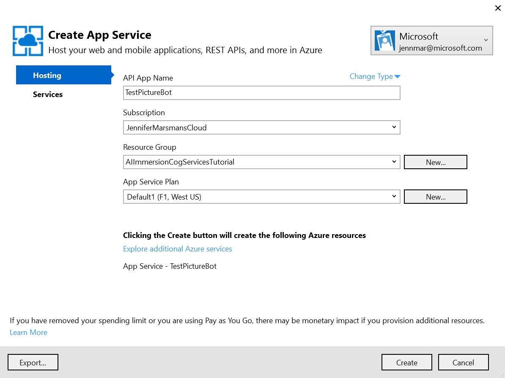

## 4_Publish_and_Register:
Estimated Time: 10-15 minutes

### Lab 4.1: Publish your bot

A bot created using the Microsoft Bot can be hosted at any publicly-accessible URL.  For the purposes of this lab, we will host our bot in an Azure website/app service.  

In the Solution Explorer in Visual Studio, right-click on your Bot Application project and select "Publish".  This will launch a wizard to help you publish your bot to Azure.  

Select the publish target of "Microsoft Azure App Service".  

 

On the App Service screen, select the appropriate subscription and click "New". Then enter an API app name, subscription, the same resource group that you've been using thus far, and an app service plan.  

 

Finally, you will see the Web Deploy settings, and can click "Publish".  The output window in Visual Studio will show the deployment process.  Then, your bot will be hosted at a URL like http://testpicturebot.azurewebsites.net/, where "testpicturebot" is the App Service API app name.  

### Lab 4.2: Register your bot with the Bot Connector

Go to a web browser and navigate to [http://dev.botframework.com](http://dev.botframework.com).  Click [Register a bot](https://dev.botframework.com/bots/new).  Fill out your bot's name, handle, and description.  Your messaging endpoint will be your Azure website URL with "api/messages" appended to the end, like https://testpicturebot.azurewebsites.net/api/messages.  

 

Then click the button to create a Microsoft App ID and password.  This is your Bot App ID and password that you will need in your Web.config.  Store your Bot app name, app ID, and app password in a safe place!  Once you click "OK" on the password, there is no way to get back to it.  Then click "Finish and go back to Bot Framework".  

 

On the bot registration page, your app ID should have been automatically filled in.  You can optionally add an AppInsights instrumentation key for logging from your bot.  Check the box if you agree with the terms of service and click "Register".  

You are then taken to your bot's dashboard page, with a URL like https://dev.botframework.com/bots?id=TestPictureBot but with your own bot name. This is where we can enable various channels.  Two channels, Skype and Web Chat, are enabled automatically.  

Finally, you need to update your bot with its registration information.  Return to Visual Studio and open Web.config.  Update the BotId with the App Name, the MicrosoftAppId with the App ID, and the MicrosoftAppPassword with the App Password that you got from the bot registration site.  

```xml

    <add key="BotId" value="TestPictureBot" />
    <add key="MicrosoftAppId" value="95b76ae6-8643-4d94-b8a1-916d9f753a30" />
    <add key="MicrosoftAppPassword" value="kC200000000000000000000" />

```

Rebuild your project, and then right-click on the project in the Solution Explorer and select "Publish" again.  Your settings should be remembered from last time, so you can just hit "Publish". 

> Getting an error that directs you to your MicrosoftAppPassword? Because it's in XML, if your key contains "&", "<", ">", "'", or '"', you will need to replace those symbols with their respective [escape facilities](https://en.wikipedia.org/wiki/XML#Characters_and_escaping): "&amp;", "&lt;", "&gt;", "&apos;", "&quot;". 

Navigate back to your bot's dashboard (something like https://dev.botframework.com/bots?id=TestPictureBot).  Try talking to it in the Chat window.  The carousel may look different in Web Chat than the emulator.  There is a great tool called the Channel Inspector to see the user experience of various controls in the different channels at https://docs.botframework.com/en-us/channel-inspector/channels/Skype/#navtitle.  
From your bot's dashboard, you can add other channels, and try out your bot in Skype, Facebook Messenger, or Slack.  Simply click the "Add" button to the right of the channel name on your bot's dashboard, and follow the instructions.

### Continue to [5_Challenge_and_Closing](./5_Challenge_and_Closing.md)  
Back to [README](./0_README.md)