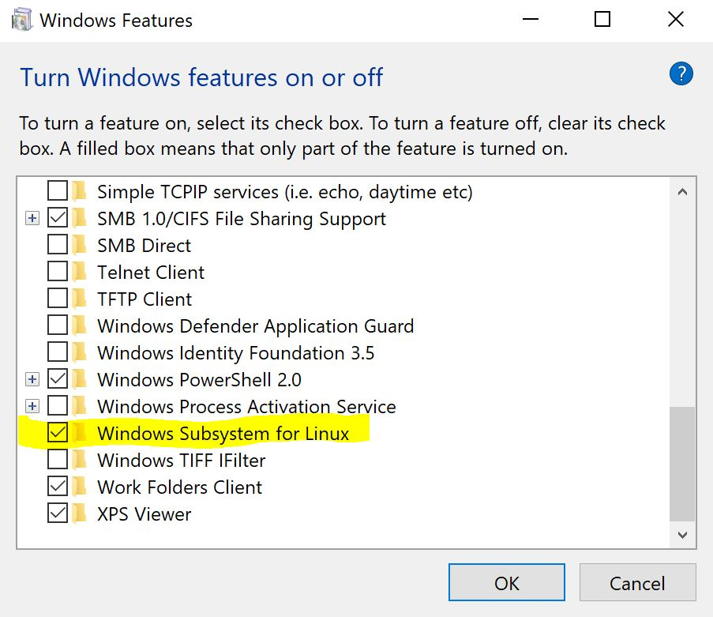
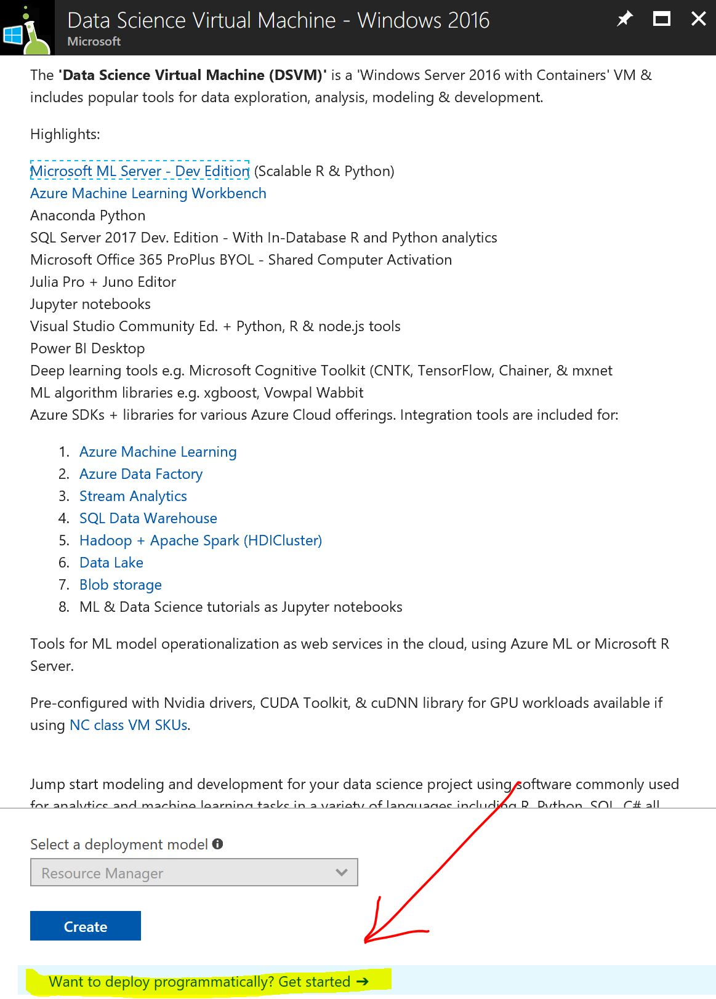
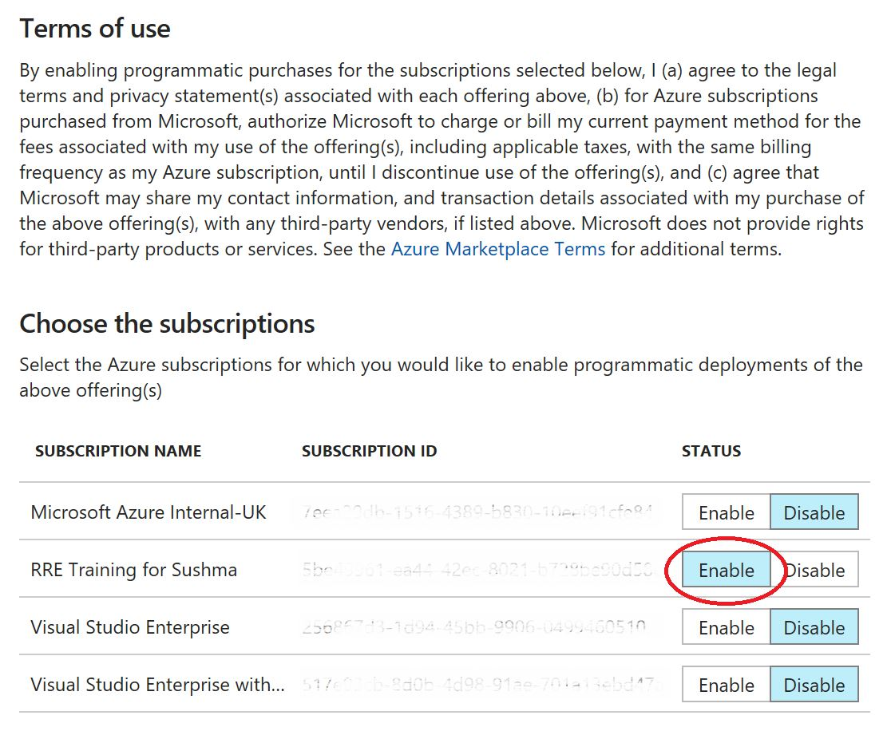
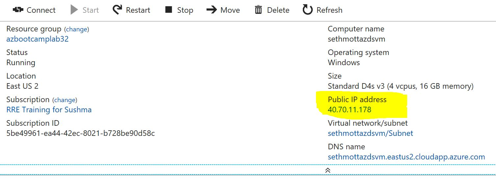
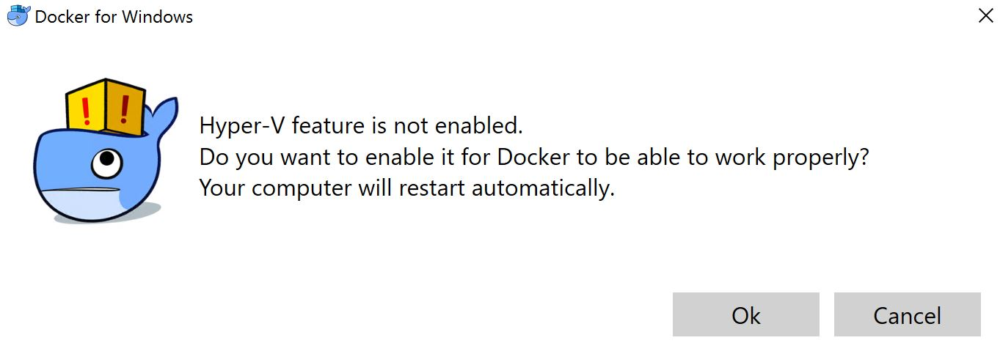

# Setting up for the bootcamp

The following steps will get us up and running for the bootcamp. For the sake of consistency, we've tried to automate as many of the steps as possible to avoid running into issues during the setup phase, but as much as possible we try to do so in a transparent fashion so users know what is happening under the hood. In addition to getting our environment ready for the bootcamp, the following outline can also serve as a short tutorial on how to manage Azure resource like a power user by leveraging the Azure CLI.

## Part 1: Provisioning a Windows Data Science Virtual Machine

For many of the labs, we will be using the [Windows Data Science Virtual Machine (DSVM)](https://azuremarketplace.microsoft.com/en-us/marketplace/apps/microsoft-ads.windows-data-science-vm) on Azure. Please follow these steps to get the DSVM ready for the lab. There are two ways to provision a DSVM: through the Azure portal UI or programatically using the [Azure CLI](https://docs.microsoft.com/en-us/cli/azure/install-azure-cli?view=azure-cli-latest) and an [ARM template](https://docs.microsoft.com/en-us/azure/azure-resource-manager/resource-group-authoring-templates). 

### 1.1 Provisioning a DSVM using the Azure portal (15 minutes)

1. Open this location and follow the instructions [shown here](https://docs.microsoft.com/en-us/azure/machine-learning/data-science-virtual-machine/provision-vm).
  a) Select the Data Science Virtual Machine - Windows 2016;
  b) Use `azureuser` and `DataScience2017!` as the admin user name and password.
  c) Select SDD Drives;
  d) Select D4S_v3 as the size (only available in [certain locations](https://azure.microsoft.com/en-us/blog/introducing-the-new-dv3-and-ev3-vm-sizes)).

If we do not wish to learn how to provision a DSVM using the Azure CLI instead of the Azure portal, we can now skip to [Preparing the environment](#preparing-the-environment).

### 1.2 **(Optinal)** Installing the Linux `bash` command prompt on Windows (15 minutes)

The Azure CLI is a command line utility for provisioning and managing Azure resources. It works on both Windows and Linux. Windows users can use it from the `cmd` command prompt, or alternatively, we can install the `bash` command prompt on Windows.

1. From the **Start Menu**, search for **Turn Windows features on or off**, then scroll down and make sure **Windows subsystem for Linux** is activated. If it is not, activate it and restart the computer.

{:width="500px"}

2. Type `cmd` from the **Start Menu** and right-click on **Command Prompt** to launch it as administrator.
3. In the command prompt, run `bash`. If `bash` is already installed on Windows then we will be presented with the `bash` command prompt. Otherwise, it will get installed for us.

### 1.3 Provisioning a DSVM using the Azure CLI (30 minutes)

1. Download and install the [Azure CLI Installer (MSI)](https://aka.ms/InstallAzureCliWindows). Once the installation is complete open the command prompt and run `az login`, then copy the access code returned to us. In a browser, open a **private tab** and enter the URL `aka.ms/devicelogin`. When prompted, paste in the access code from above. We will next be prompted to authenticate using our Azure account.
2. Log into the Azure Portal and click on  and search for and select **Data Science Virtual Machine - Windows 2016**. On the resources' page, click on the link in the buttom that says <u>Want to deploy programmatically? Get started ➔</u>. 

   {:width="600px"}

   Scroll down and make sure that the status is enabled for the intended subscription.

   {:width="600px"}

2. From **Windows Explorer** navigate to the course folder and from there launch the command prompt by going to the address bar and typing `cmd` (for the Windows command prompt) or `bash` (for the Linux command prompt assuming it is installed already) and type `az --version` to check the installation. Run `az group create -n azurebootcamp -l eastus2` to create a resource group called `azurebootcamp`. Next run the following command to provision the DSVM:
```
az group deployment create -g azurebootcamp --template-file template-dsvm.json --parameters @parameters-dsvm.json
```
Once the provisioning is finished, we can run `az resource list -g azurebootcamp -o table` to check what resources were launched. Our listed resources includes a DSVM called `azbootcampdsvm`, which we provided in the `parameters.json` file.  
FYI, we can start/stop/restart our VM using the corresponding commands below:
```
az vm start -g azurebootcamp -n azbootcampdsvm
az vm stop -g azurebootcamp -n azbootcampdsvm
az vm restart -g azurebootcamp -n azbootcampdsvm
```

## Part 2: Preparing the DSVM to run Azure ML Workbench

### 2.1 Installing Docker and Workbench and creating an ML account (30 minutes)

We now have a DSVM provisioned and almost ready to use. In this part, we log into the DSVM and install the necessary pre-requsites in order to start using Azrue ML Workbench (or Workbench for short). In order to log into the DSVM, we type `rdp` from the **Start Menu** and click on **Remote Desktop Connection**. We then enter the DSVM's IP address, which we can find by logging into the Azure portal and clicking on the DSVM under our resource group `azurebootcamp`.

{:width="600px"}

1. On the DSVM, open the browser and navigate to [https://aka.ms/azureml-wb-msi](https://aka.ms/azureml-wb-msi), run the downloader to install Workbench. This will take between 10 and 20 minutes.
2. On the DSVM, download and run the [Docker installer](https://download.docker.com/win/stable/Docker%20for%20Windows%20Installer.exe) for Windows. Logout upon completion, but do NOT log out until Workbench has finished installing (previous step).
3. Log back into the DSVM and launch Docker. When prompted to enable Hyper-V, do so. After a few seconds, this will restart the server and we will need to log back in.

{:width="600px"}

### 2.2 Preparing the Workbench to run a project (10 minutes)

For the remainder of this lab, we will be working exclusively on the DSVM. So log into the DSVM and then run through the steps outlined here.

1. Launch Docker for Windows and while waiting for Docker to start running, open the Azure Machine Learning Workbench. When prompted to authenticate using an Azure account, please do so.
2. Click on initials at the bottom-left corner of the Workbench and make sure that we are using the correct account (namely the Experimentation account and matching Model Management account we created in section 2.1.4).
3. Go to **File > Configure Project IDE** and name the IDE `Code` with the following path `C:\Program Files\Microsoft VS Code\Code.exe`. This will allow us to open the entire project in Visual Studio Code, which is our editor of choice for this lab.
4. Go to **File > Open Project (VSCode)** to open the project in Visual Studio Code. It is not necessary to use Code to make edit our course files but it is much more convenient. We will return to Code when we need to make changes to the existing scripts.
5. We now log into the Azure CLI using our Azure account. Return to the Workbench and go to **File > Open Command Prompt**. Check that the Azure CLI is installed on the DSVM by typing `az -h`. Now type `az login` and copy the access code. In Firefox open a **private tab** using **CTRL+SHIFT+P** then enter the URL `aka.ms/devicelogin` and when prompted, paste in the access code. Next, authenticate using an Azure account.
6. We now set the Azure CLI to use the right Azure account. From the command prompt, enter `az account list –o table` to see available accounts. Then copy the subscription ID from the Azure account used to create an AML Workbench account and type `az account set –s <subscription_id>`, replacing `<subscription_id>` with the account ID.
