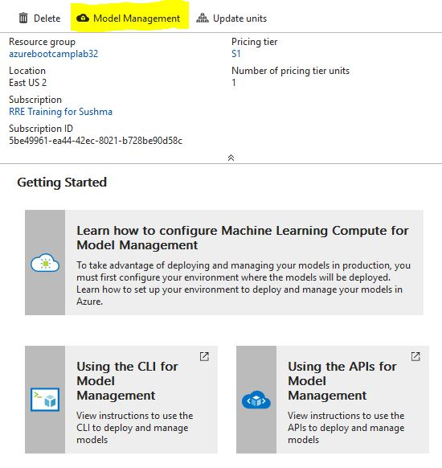
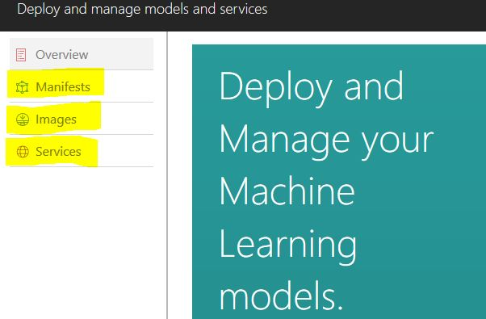

# Manage Models with Azure Machine Learning Workbench and related services

This hands-on lab guides you through managing and regtraining models using [Azure Machine Learning Services](https://docs.microsoft.com/en-us/azure/machine-learning/preview/overview-what-is-azure-ml) with the Azure Machine Learning Workbench. 

In this workshop, you will:
- [ ] Understand Machine Learning Model versioning
- [ ] Track models
- [ ] Create Docker containers with the models and test them locally

You'll focus on the objectives above, not Data Science, Machine Learning or a difficult scenario.  

***NOTE:*** There are several pre-requisites for this course, including an understanding and implementation of: 
  *  Programming using an Agile methodology
  *  Machine Learning and Data Science
  *  Working with the Microsoft Azure Portal

There is a comprehensive Learning Path you can use to prepare for this course [located here](https://github.com/Azure/learnAnalytics-CreatingSolutionswiththeTeamDataScienceProcess-/blob/master/Instructions/Learning%20Path%20-%20Creating%20Solutions%20with%20the%20Team%20Data%20Science%20Process.md).

## Azure Machine Learning Model Management

Here is the high-level architecture of an end-to-end solution with Azure ML Workbench (or Workbench for short) handling both the development and operationalization of a Machine Learning model. We should return to this chart as we run through this lab to see how all the pieces come together.


The three main Azure resources we will consume in this lab are as follows:

 - An **Experimentation account** contains workspaces, which is where our projects are sitting. When working in teams, we can add multiple users or "seats" to an experimentation account. To use the Workbench and run experiments, we must create an experimentation account.
 - A **Model Management account** is for managing models. Model management is essential to both model development and deployment. We use a model management account to register models and bundle models and code (including dependencies) into **manifests**. Manifests are in turn used to create Docker **images**, and those images in turn build containerized web services that run instances of our deployed application, locally or in the cloud.
 - An **Environment** denotes a particular computing resource that is used for deploying and managing models. It can be a local computer, a Linux VM on Azure, or a Kubernetes cluster running in Azure Container Service. A model hosted in a Docker container runs in these environments and is exposed as a REST API endpoint.

After this lab is finished, we will have a better idea of how to use the Workbench and accompanying Azure services in order to:

- Minimize the time and effort that goes into the iterative process of building and evaluating ML models
- Smooth out the transition of going from development to production for operationalizing ML models
- Get back to doing more data science and less administrative or devops types of tasks

### Running the modeling script in Docker

Our task in this section is to successfully run the project in a Docker container. To do so, we will need to start a new Workbench project based on an existing template and make a set of changes to the project in order to run it successfully. 

1. Open the Workbench and press **CTRL+N** to create a new project. Name the project `churn_prediction` and use the `Documents` folder as the project directory. Finally, in the box called `Search Project Templates`, type `churn` and select the template called `Customer Churn Prediction`. Press **Create** to create the project.
2. Go to **File > Open Project (Code)** to edit the project scripts using Code. Find the script `CATelcoCustomerChurnModelingWithoutDprep.py` and find the line where the data is read: `df = pd.read_csv('data/CATelcoCustomerChurnTrainingSample.csv')` to see how the raw data is read.
3. Go to `aml_config/docker.runconfig` and replace its content with 
```
ArgumentVector:
  - "$file"
Target: "docker"
EnvironmentVariables:
  "EXAMPLE_ENV_VAR": "Example Value"
Framework: "PySpark"
CondaDependenciesFile: "aml_config/conda_dependencies.yml"
SparkDependenciesFile: "aml_config/spark_dependencies.yml"
PrepareEnvironment: true
TrackedRun: true
```
4. On Code, go to **File > Save All** to save all the above changes. Then return to the Workbench and check to make sure the changes are visible here. We can check by clicking on the **Files** tab on the left pannel and opening one of the files we changed.
5. In order to run the experiment in a Docker container, we must prepare a Docker image. We will do so programatically by going to **File > Open Command Prompt** and typing `az ml experiment prepare -c docker`. Notice all the changes that are happening as this command is running. This should take a few minutes.
**Note:** At this point, there is a strange Docker behavior for which we propose an easy solution: we may get an error at the top about `image operating system "linux" cannot be used on this platform`.

   {:width="500px"}

   To resolve it we click on the Docker logo on the right-hand side in the taskbar and switch Docker to use Windows containers. This will result in a new Docker error:

   {:width="400px"}

   Now we switch Docker back to Linux containers (by going to the taskbar once more).

   {:width="300px"}

   We then return to the command prompt and run the above command again. This will take a few minutes. When finished, we should get a message saying `Your environment is now ready`.
6. We can now run our experiment in a Docker container by submitting the following command: `az ml experiment submit -c docker CATelcoCustomerChurnModelingWithoutDprep.py`. Alternatively, we can go to the **Project Dashboard**, select "docker" as the run configuration, select the `CATelcoCustomerChurnModelingWithoutDprep.py` script and click on the run button. In either case, we should be able to see a new job starting on the **Jobs** in the pannel on the right-hand side. Click on the finished job to see the **Run Properties** such as **Duration**. Notice under **Outputs** there are no objects, so the script did not create any artifacts. Click on the green **Completed** to see any results printed by the script, including the model accuracy. It is worth noting that the Azure CLI runs on both the Windows and Linux command line. To see this in action, from the Windows command prompt type `bash` to switch to a Linux command prompt and submit `az ml experiment submit -c docker CATelcoCustomerChurnModelingWithoutDprep.py` a second time.
7. Return to Code and add the following code snippet to the bottom of `CATelcoCustomerChurnModelingWithoutDprep.py` and rerun the experiment. The purpose of the code snippet is to serialize the model on disk in the `outputs` folder.
```
import pickle
print ("Export the naive bayes model to model.pkl")
f = open('./model.pkl', 'wb')
pickle.dump(model, f)
f.close()
```
8. Rerun the experiment and when finished click on the job and notice the output `model.pkl` in the **Run Properties** pane under **Outputs**. Select this output, download it and place it in root folder.

### Creating a web service out of the scoring script

Let's now see how we can create a scoring web service from the above model inside a docker image. There are multiple steps that go into doing that. We will be running commands from the command line, but we will also log into the Azure portal in order to see which resources are being created as we run various Azure CLI commands.

1. Enable the Azure Container Service by running `az provider register -n Microsoft.ContainerService` from the command line.
2. Run `az group create -n azurebootcamplab43 -l eastus2` to create a resource group called `azurebootcamplab43` for the resources we will provision throughout this lab. Then run `az ml account modelmanagement create -l eastus2 -n azureuseramlmm -g azurebootcamplab43` to create a model management account.
3. Log into the Azure portal and find all the resources under the resource group `azurebootcamplab43`. This should include an Experimentation and a Model Management account. Open the Model Management resource and click on **Model Management** icon on the top.
4. If we're doing this for the first time, then we need to set up an environment. We usually have a staging and a production environment. We can deploy our models to the staging environment to test them and then redeploy them to the production environment once we're happy with the result. To create a new environment run the following command. To use in production, we can use --cluster:
```
az ml env setup -l eastus2 -n bootcampvmstage -g azurebootcamplab43
```
We can look at all the environments uder our subscription using `az ml env list -o table`. Creating the new environment takes about one minute, after which we can activate it and show it using this:
```
az ml env set -n bootcampvmstage -g azurebootcamplab43
az ml env show
```
5. We next set our Model Management account by running this:
```
az ml account modelmanagement set -n azureuseramlmm -g azurebootcamplab43
```
6. We are now finally ready to deploy our model as a web service. We do so by running `az ml service create realtime -n churnpred --model-file ./model.pkl -f score.py -r python -s service_schema.json`. Notice the three steps that take place as the command is running. First we register the model, then we create a manifest, then we create a Docker image, and finally we initialize a Docker container that services our prediction app. We can go to the Azure portal and go to click on the resource named `azureuseramlmm` under the resource group `azurebootcamplab43`, then click on **Model Management**.

   {:width="500px"}

   In the Model Management portal, we can view the three resources that are created as the above command runs: the manifest, the image, and the service. Click on each to view the resources.

   {:width="500px"}

## Workshop Completion

In this workshop you learned how to:
- [ ] Track models
- [ ] Create Docker containers with the models and test them locally

You may now decommission and delete the following resources if you wish:
  * The Azure Machine Learning Services accounts and workspaces, and any Web API's
  * Any Data Science Virtual Machines you have created. NOTE: Even if "Shutdown" in the Operating System, unless these Virtual Machines are "Stopped" using the Azure Portal you are incurring run-time charges. If you Stop them in the Azure Portal, you will be charged for the storage the Virtual Machines are consuming.
