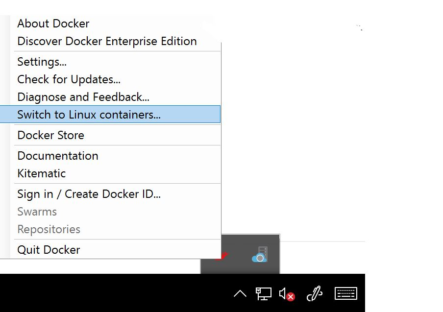

# Parallel parameter sweeps (hyper-parameter tuning) on Spark

In this lab, we will use the Azure CLI to provision and configure a HDI Spark cluster and use Docker containers on it to run parameter sweep for a given model. Parameter sweep is more commonly known as hyper-parameter tuning. A hyper-parameter is any model input that cannot be directly learned from data and must instead be declared (or guessed) by the data scientist. In order to choose good hyper-parameter values data scientists rely in some cases on no more than some basic rules of thumb and lots of trial and error. Most models have not one but many hyper-parameters and therefore finding a good combination of hyper-parameters (using grid search for example) is a very iterative process. When we "tune" (roughly optimize) our hyper-parameters we train models with different values for hyper-parameters each time and choose the that works best. It is therefore essential to be able to run multiple models efficiently and concurrently. Spark clusters are a good place to perform parameter sweep because we can run many jobs in parallel and let Spark handle the load-balancing and management.

1. Open the Azure ML Workbench and start a new project called `parameter_sweep` under `Documents` and make it use the **Parameter Sweep on Spark** as template. Place the new project in **Documents**. Open the project and go to **File > Open Command Prompt**. To create a Spark cluster we will use the template found [here](https://portal.azure.com/#create/Microsoft.Template/uri/https%3A%2F%2Fraw.githubusercontent.com%2FAzure%2Fazure-quickstart-templates%2Fmaster%2F101-hdinsight-spark-linux%2Fazuredeploy.json) and the Azrue CLI. The credentials to log into the cluster along with some other information is stored in `parameters-hdi.json`. To provision the cluster, first copy the files `template-hdi.json` and `parameters-hdi.json` into the project directory. we simply run the command below (if we do not wish to store passwords in the file, we can remove them and instead we will be prompted to enter a password when we run the command). If the commands below fails (a likely scenario) it is likely to be because of you need to rename your storage account (storage account names must be unique in each region). Change the commands below and go into `template-hdi.json` to make the appropriate changes and rerun the commands. In case the last command fails for less predictable reasons, please refer to [this link](https://docs.microsoft.com/en-us/azure/hdinsight/spark/apache-spark-jupyter-spark-sql) to provision an HDI cluster from the Azure portal.
```
az group create -n azurebootcamplab41 -l eastus2
az storage account create -n azbcsparkeastus2 -g azurebootcamplab41 --sku Standard_LRS
az group deployment create -g azurebootcamplab41 --template-file template-hdi.json --parameters @parameters-hdi.json
```
2. Type the following commands to prepare the docker environment and the Spark cluster to run our jobs.
```
az ml experiment prepare -c docker
```
**Note:** At this point, there is a strange Docker behavior for which we propose an easy solution: we may get an error at the top about `image operating system "linux" cannot be used on this platform`.

   {:width="500px"}

   To resolve it we click on the Docker logo on the right-hand side in the taskbar and switch Docker to use Windows containers. This will result in a new Docker error:

   {:width="400px"}

   Now we switch Docker back to Linux containers (by going to the taskbar once more).

   {:width="300px"}

   We then return to the command prompt and run the above command again. This will take a few minutes. When finished, we should get a message saying `Your environment is now ready`.
3. Return to the Workbench and go to **File > Open Project (Code)** to open it using Code. Examine the script `sweep_spark.py`. Find the learning algorithm we're using and the set of hyper-parameters that we want to optimize over and their ranges.
4. Now we specify the Spark cluster as the compute target by running the following command.
The command may return an error message about having to prepare the environment first, even though the previous command should have been prepared the environment already. Running the rest of the code still works and the error message can safely be ignored.
```
az ml computetarget attach cluster --name azbootcamphdispark --address azbootcamphdispark-ssh.azurehdinsight.net --username sshuser --password DataScience2017!
az ml experiment prepare -c azbootcamphdispark
```
This will create the files `aml_config/azbootcamphdispark.compute` and `aml_config/azbootcamphdispark.runconfig`. We now have a pair of such files for local, Docker and one for Spark.
5. Finally, we can now run the job. We will first run it in Docker, which is great for debugging purposes and working locally while we're still in development mode. To do so just run this on the command line:
```
az ml experiment submit -c docker .\sweep_spark.py
```
If we were able to run the Docker example successfully, we can now see if we can replicate it in Spark. To do so simply replace `docker` with `azbootcamphdispark` in the above command and rerun it. If the Docker run failed, we may need to swich Docker to a Windows context (by right-clicking on the Docker icon in the taskbar) and upon getting an error message, switch it back to a Linux context and then try again.
6. Report the accuracy of the best model that came out of the parameter sweep.
